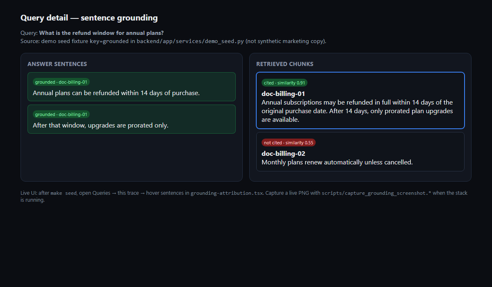

# RAGInspector

**Find why your RAG app fails — in under 30 seconds.**

Open-source **RAG pipeline debugger** for engineers shipping retrieval-augmented generation: instrument with a Python SDK, analyze traces asynchronously (sentence-level NLI grounding, BM25 vs vector, failure class, Trust Score), and inspect attribution in a Next.js dashboard.

Self-host with free OSS tooling only (Docker Compose, Postgres, Redis, Celery, Prometheus/Grafana, GitHub Actions).

**New to the repo?** Read [PROJECT_GUIDE.md](PROJECT_GUIDE.md) — canonical engineering overview (architecture, trade-offs, failure modes, interview prep).

**QA / interview readiness:** [docs/qa/README.md](docs/qa/README.md) — feature inventory, manual tests, demo seed, API examples, readiness report.



---

## Business problem

| | |
|--|--|
| **Problem** | Production RAG fails without separating *retrieval* misses from *generation* hallucinations. Teams guess from logs. |
| **Who** | ML/backend/platform engineers building support bots, internal knowledge Q&A, search+answer products. |
| **Why not Langfuse / generic LLM ops alone** | Those center prompts and spans; they rarely show sentence↔chunk grounding, BM25 vs dense ranking, or a Trust Score tied to $/wrong-answer. |
| **Success** | Root-cause a bad answer in &lt;30s on seeded data; trend Trust Score / grounded fraction; optional hallucination cost signal. |

**Vision:** Detect → Explain → Recommend → Verify — without claiming unfinished SSO/billing as GA ([docs/EXPERIMENTAL.md](docs/EXPERIMENTAL.md)).

---

## Architecture

```text
Your RAG app ── SDK / API key ──► Nginx ──► FastAPI ──► PostgreSQL
                                      │
                                      ▼
                                Celery + Redis
                         (NLI grounding, BM25, Trust Score)
                                      │
                                      ▼
                              Next.js dashboard
```

| Flow | Doc |
|------|-----|
| Ingest → analysis → UI | [docs/architecture/](docs/architecture/) |
| Design narrative | [docs/ARCHITECTURE.md](docs/ARCHITECTURE.md) |
| ADRs | [docs/adr/](docs/adr/) |

**Request path:** SDK `POST /api/v1/ingest/trace` → persist chunks → enqueue Celery → worker runs grounding/BM25/failure/Trust → dashboard `GET /queries/{id}`.

---

## Features (verified product surface)

| Feature | Status |
|---------|--------|
| SDK ingest + LangChain / LlamaIndex / Haystack adapters | Live |
| Sentence ↔ chunk grounding UI | Live |
| BM25 vs vector comparison | Live |
| Failure classification + Trust Score + hallucination cost | Live |
| Knowledge gaps, autofix, monitoring, regression, documents | Live (scoped) |
| JWT + refresh denylist, MFA TOTP, API keys, org RBAC | Live |
| Prometheus metrics + Compose observability overlay | Live |
| Google SSO / Razorpay / SAML / SCIM | Partial or experimental — see EXPERIMENTAL.md |

Honest inventory: [docs/IMPLEMENTED.md](docs/IMPLEMENTED.md)

---

## Quick start

```bash
git clone <this-repo>
cd raginspector
cp .env.example .env          # SECRET_KEY ≥ 32 chars
make bootstrap                # build → up → migrate → health
make seed                     # demo@example.com / DemoPass123!
```

**Windows** (ports 3000/5432 often busy):

```powershell
.\scripts\setup.ps1
docker compose -f docker-compose.yml -f docker-compose.verify-ports.yml up -d --build
docker compose -f docker-compose.yml -f docker-compose.verify-ports.yml run --rm backend alembic upgrade head
docker compose -f docker-compose.yml -f docker-compose.verify-ports.yml run --rm backend python scripts/seed_demo.py
```

| Surface | Default | Verify-ports overlay |
|---------|---------|----------------------|
| UI | http://localhost:3000 | http://localhost:13000 |
| API | http://localhost:8000 | http://localhost:18000 |
| Nginx | http://localhost:80 | http://localhost:18080 |

Login: **demo@example.com** / **DemoPass123!**  
API docs (dev): `/docs` · `/redoc`

**Interview / hiring demo:** use the low-RAM overlay and full validation guide — [docs/INTERVIEW_DEPLOYMENT.md](docs/INTERVIEW_DEPLOYMENT.md) (`docker-compose.interview.yml`).

**Free cloud (portfolio):** Vercel frontend + Render API/Postgres — [docs/DEPLOYMENT.md](docs/DEPLOYMENT.md) (`render.yaml`, `frontend/vercel.json`).

**What keys do I need?** [API_KEYS_GUIDE.md](API_KEYS_GUIDE.md) — required vs optional, verified from source.

---

## Tech stack

| Layer | Choice |
|-------|--------|
| API | FastAPI, SQLAlchemy, Alembic, Pydantic |
| Workers | Celery, Redis, sentence-transformers (local NLI) |
| UI | Next.js 15, TypeScript, TanStack Query, Tailwind |
| Data | PostgreSQL 16 (+ pgvector image) |
| Edge | Nginx |
| Observability | Prometheus, Grafana, exporters; optional OTel extras |
| CI | GitHub Actions |
| Load / E2E | k6, Locust, Playwright |

Technology reasoning: [docs/engineering/DESIGN_DECISIONS.md](docs/engineering/DESIGN_DECISIONS.md)

---

## Project structure

```text
backend/     FastAPI, services, Celery workers, Alembic
frontend/    Next.js App Router dashboard + Playwright e2e
sdk/         Python tracer + framework integrations
docs/        Architecture, ops, case studies, PRD archive
infrastructure/  Helm / K8s / Terraform notes
loadtests/   k6 + Locust
nginx/       Reverse proxy
```

---

## API overview

- OpenAPI: `http://localhost:8000/openapi.json`
- Guide: [docs/API.md](docs/API.md)
- Collections: [docs/api/](docs/api/)

```python
from raginspector import RAGInspector

inspector = RAGInspector(
    api_key="ri-...",
    pipeline_name="my-rag",
    base_url="http://localhost:8000",
)
```

---

## Testing

| Suite | Command | Notes |
|-------|---------|-------|
| Backend unit | `cd backend && pytest tests/unit/ -q` | Coverage gate ≥95% on critical services/workers |
| Backend API | `pytest tests/test_api.py -q` | |
| Integration | `pytest tests/integration/ -q` | |
| SDK | `cd sdk && pytest -q` | |
| Frontend | `cd frontend && npm test` | |
| E2E | `npm run test:e2e` | Point at the correct UI port — see [frontend/e2e/README.md](frontend/e2e/README.md) |
| Load | `k6 run loadtests/k6/smoke.js` | Requires k6 installed |

CI: [`.github/workflows/ci.yml`](.github/workflows/ci.yml)

---

## Security

- bcrypt passwords, hashed API keys, JWT (PyJWT) + refresh revoke / access denylist
- MFA TOTP (encrypted secrets), rate limits, security headers, prod fail-closed settings
- Bandit / pip-audit / npm audit / Trivy / Gitleaks in CI
- Details: [SECURITY.md](SECURITY.md) · [docs/SECRETS.md](docs/SECRETS.md)

**Known residual:** SAML/SCIM experimental; JWT denylist fail-open without Redis (short access TTL + metric).

---

## Performance & benchmarks

- Measured baselines and rate-limit notes: [docs/engineering/PERFORMANCE.md](docs/engineering/PERFORMANCE.md)
- Harness: `loadtests/bench_verify.py`, `loadtests/bench_auth_load.py` (see [loadtests/README.md](loadtests/README.md))
- Cold-start ML load: [docs/COLD_START.md](docs/COLD_START.md)

---

## Monitoring & ops

```bash
make up-obs
# Prometheus http://localhost:19090
# Grafana    http://localhost:13001
```

Deploy: [docs/DEPLOYMENT.md](docs/DEPLOYMENT.md) · TLS: [docs/TLS.md](docs/TLS.md) · Backup/DR: [docs/BACKUP.md](docs/BACKUP.md) · [docs/DISASTER_RECOVERY.md](docs/DISASTER_RECOVERY.md)

---

## Case studies

Engineering-style narratives (not marketing):

| Case | File |
|------|------|
| Fintech hallucination cost | [docs/case-studies/01-fintech-hallucination-cost.md](docs/case-studies/01-fintech-hallucination-cost.md) |
| Healthcare retrieval quality | [docs/case-studies/02-healthcare-retrieval-quality.md](docs/case-studies/02-healthcare-retrieval-quality.md) |
| SaaS pre-deploy regression | [docs/case-studies/03-saas-pre-deploy-regression.md](docs/case-studies/03-saas-pre-deploy-regression.md) |
| Ecommerce knowledge gaps | [docs/case-studies/04-ecommerce-knowledge-gaps.md](docs/case-studies/04-ecommerce-knowledge-gaps.md) |
| Enterprise SSO / observability | [docs/case-studies/05-enterprise-sso-observability.md](docs/case-studies/05-enterprise-sso-observability.md) |
| Legal-tech vector DB evaluation | [docs/case-studies/06-legaltech-vector-db-evaluation.md](docs/case-studies/06-legaltech-vector-db-evaluation.md) |

---

## Roadmap & lessons

- Execution contract: [ROADMAP.md](ROADMAP.md)
- What shipped vs experimental: [docs/IMPLEMENTED.md](docs/IMPLEMENTED.md)
- Prefer a deep correct core over stubby enterprise width
- Label incomplete IdP/billing honestly — recruiters notice fakes

**Future work (highest ROI):** stabilize Windows host↔publish-port reliability docs; graduate SCIM/SAML only with real IdP tests; broaden Playwright CI against Compose; optional nightly Locust soak.

---

## FAQ

[docs/FAQ.md](docs/FAQ.md)

- **Billing required?** No for local free tier.  
- **Google SSO required?** No — optional env.  
- **GPU required?** No for NLI path (CPU); optional LLM judge via HF/Ollama.

---

## Contributing

[CONTRIBUTING.md](CONTRIBUTING.md) · [docs/DEVELOPER.md](docs/DEVELOPER.md) · [docs/engineering/](docs/engineering/)

## License

[MIT](LICENSE)

---

## Hiring / deep dive

**Start here:** [PROJECT_GUIDE.md](PROJECT_GUIDE.md)

Also: [docs/HIRING.md](docs/HIRING.md) · [docs/demo/](docs/demo/) · [docs/case-studies/](docs/case-studies/)
