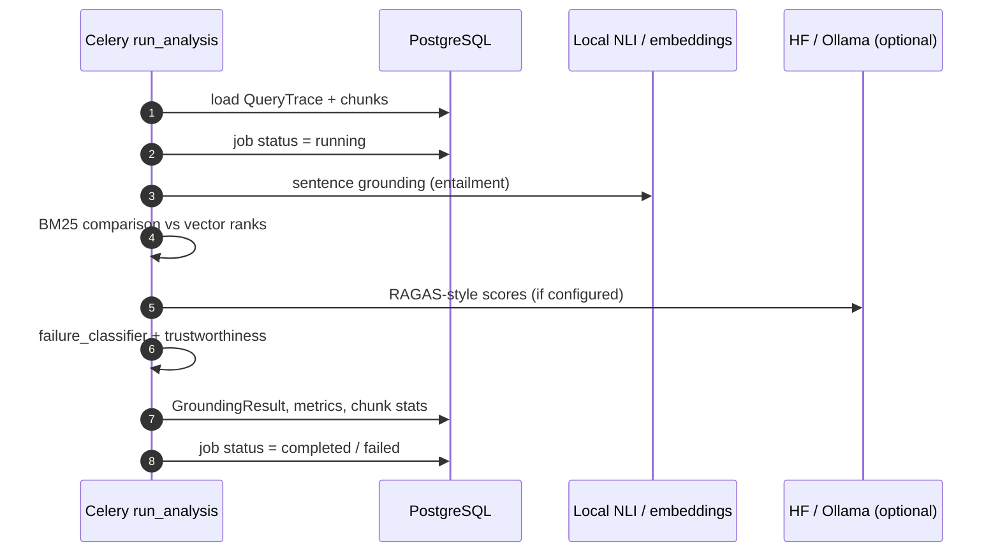

# Analysis sequence (worker pipeline)

```mermaid
sequenceDiagram
    autonumber
    participant W as Celery run_analysis
    participant DB as PostgreSQL
    participant NLI as Local NLI / embeddings
    participant LLM as HF / Ollama (optional)

    W->>DB: load QueryTrace + chunks
    W->>DB: job status = running
    W->>NLI: sentence grounding (entailment)
    W->>W: BM25 comparison vs vector ranks
    W->>LLM: RAGAS-style scores (if configured)
    W->>W: failure_classifier + trustworthiness
    W->>DB: GroundingResult, metrics, chunk stats
    W->>DB: job status = completed / failed
```

Core services: `app/services/grounding.py`, `bm25_service.py`, `failure_classifier.py`, `trustworthiness_service.py`, `trust_scorer.py`.
