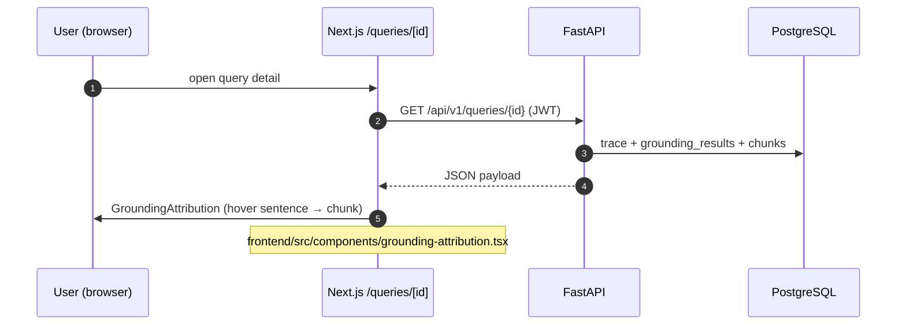

# Dashboard inspect sequence

```mermaid
sequenceDiagram
    autonumber
    participant U as User (browser)
    participant UI as Next.js /queries/[id]
    participant API as FastAPI
    participant DB as PostgreSQL

    U->>UI: open query detail
    UI->>API: GET /api/v1/queries/{id} (JWT)
    API->>DB: trace + grounding_results + chunks
    API-->>UI: JSON payload
    UI->>U: GroundingAttribution (hover sentence → chunk)
    Note over UI: frontend/src/components/grounding-attribution.tsx
```

Demo login after seed: [SEED.md](../SEED.md). Screenshot notes: [../screenshots/](../screenshots/).
