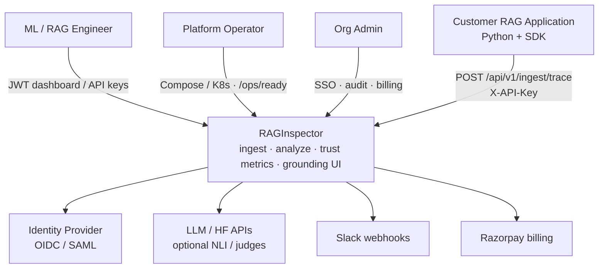

# System context (C4 Level 1)

High-level view of how customer RAG applications, operators, and identity providers interact with RAGInspector. The platform ingests traces, analyzes them asynchronously, and exposes grounding and metrics through a dashboard and REST API.

See also: [ARCHITECTURE.md](../ARCHITECTURE.md), [05-container-diagram.md](05-container-diagram.md).
