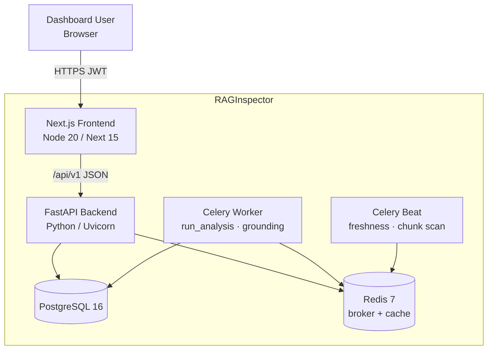

# Container diagram (C4 Level 2)

Runtime containers that make up a typical Docker Compose or Kubernetes deployment of RAGInspector. Each box is an independently deployable process with its own scaling and health checks.

Local ports (Compose): API `8000`, UI `3000`, Postgres `5432`, Redis `6379`. Production images and Helm charts live under `infrastructure/`.

See also: [10-deployment-diagram.md](10-deployment-diagram.md), [WORKER.md](../WORKER.md).
