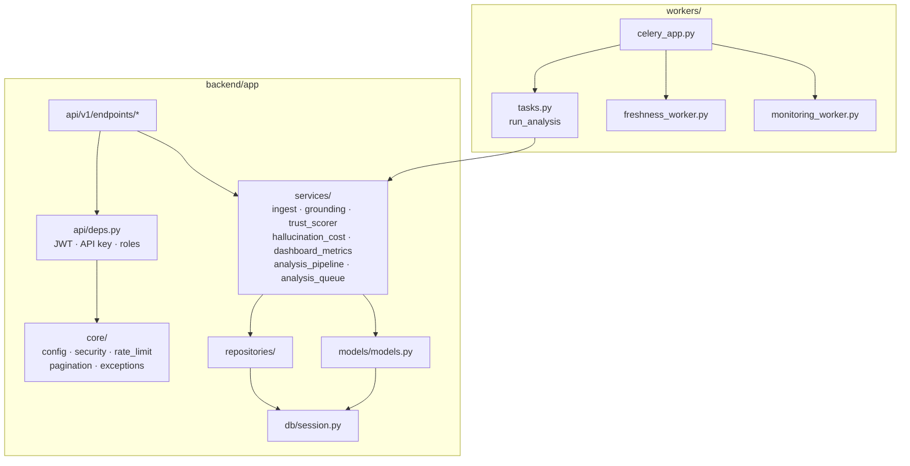

# Backend component diagram (C4 Level 3)

Internal structure of the FastAPI backend and worker process. Boundaries follow the existing package layout: `api` → `services` → `repositories` / `models`, with Celery tasks calling the same analysis services.

| Layer | Responsibility |
|-------|----------------|
| Endpoints | HTTP contracts, auth dependency injection, SlowAPI limits |
| Services | Domain logic (ingest, analysis, metrics, SSO helpers) |
| Repositories | Optional query helpers for pipelines and list filters |
| Workers | Async analysis and beat jobs; share service code with API |

See also: [07-service-diagram.md](07-service-diagram.md), [FOLDER_STRUCTURE.md](../engineering/FOLDER_STRUCTURE.md).
