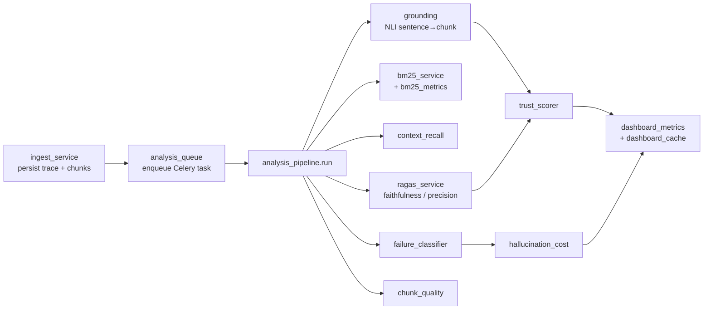

# Analysis service collaboration

How core analysis services collaborate after a trace is ingested. `analysis_pipeline` orchestrates grounding, BM25, RAGAS-style metrics, trust scoring, failure classification, and chunk quality updates.

Primary entry points:

- Ingest: `POST /api/v1/ingest/trace` → `ingest_service` → `analysis_queue`
- Worker: `run_analysis(trace_id)` → `analysis_pipeline`
- Dashboard: `GET /api/v1/metrics/dashboard` → `dashboard_metrics` (Redis TTL cache)

See also: [02-analysis-sequence.md](02-analysis-sequence.md), [12-worker-architecture.md](12-worker-architecture.md).
