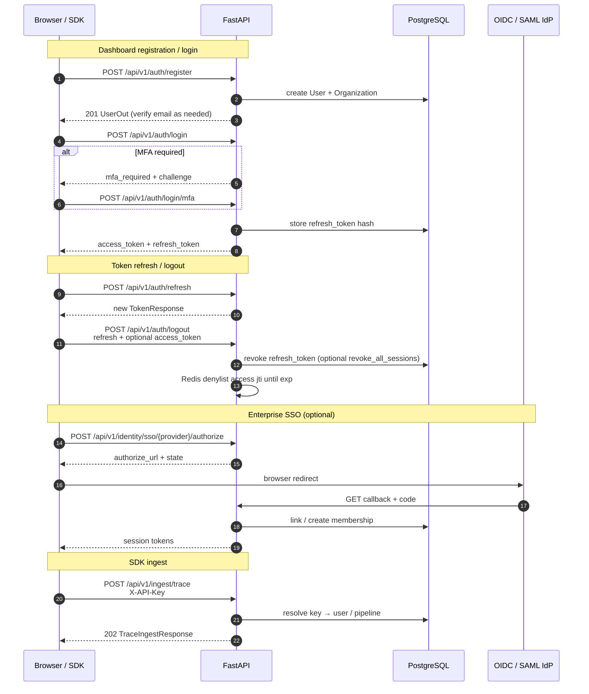

# Authentication and authorization flows

RAGInspector supports two client auth modes: **JWT Bearer** for the dashboard (register / login / refresh / MFA) and **API keys** (`X-API-Key`) for SDK ingest. Enterprise orgs can require SSO and MFA.

| Mechanism | Header / body | Typical clients |
|-----------|---------------|-----------------|
| Access JWT | `Authorization: Bearer <token>` | Next.js dashboard, curl |
| Access JWT denylist | Redis `jwt:deny:{jti}` on logout | Stolen access tokens rejected until TTL |
| Refresh JWT | `POST /auth/refresh` body | Token rotation |
| API key | `X-API-Key: ri_...` | Python SDK, CI ingest |
| Role gate | JWT claims + org membership | Admin, audit, SSO setup |
| Pipeline ACL | Owner **or** same-org accepted member | List/get/stats; mutations remain owner-only |

Rate limits (per IP, SlowAPI): register `10/min`, login `20/min`, refresh `30/min`, ingest `120/min`. See `app/core/rate_limit.py`.

See also: [SECURITY.md](../engineering/SECURITY.md), [API.md](../API.md).
