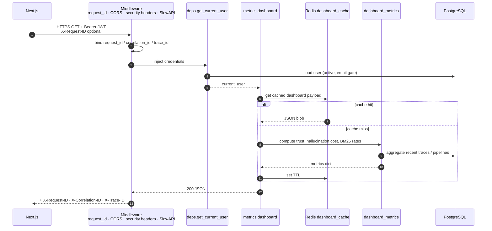

# Typical authenticated request flow

End-to-end path for a dashboard JWT request (for example `GET /api/v1/metrics/dashboard`) and how middleware, auth, caching, and logging wrap the handler.

Notes:

- Failed dependency auth returns `401` / `403` before the endpoint runs.
- Domain errors (`BaseRAGInspectorError`) map to stable `{ detail: { message, code, details } }` JSON.
- Ingest requests skip JWT and use API-key resolution instead; they still receive request ID headers.

See also: [03-dashboard-sequence.md](03-dashboard-sequence.md), [DASHBOARD_CACHE.md](../DASHBOARD_CACHE.md).
