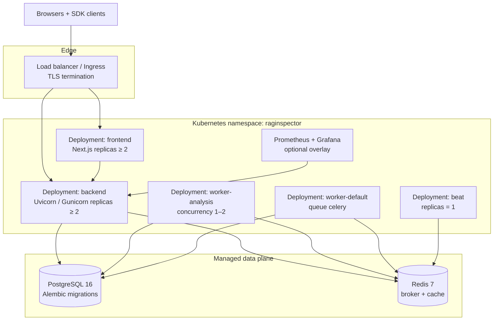

# Deployment topology

Recommended production-shaped topology using Kubernetes (or Compose Prod) with separate API, worker, and beat workloads, plus managed Postgres and Redis. Observability scrapes Prometheus metrics from the API.

| Workload | Health | Scale signal |
|----------|--------|--------------|
| `backend` | `/live`, `/api/v1/ops/ready` | CPU RPS + p95 latency |
| `worker-analysis` | process liveness + backlog drain | `celery_queue_depths.analysis` |
| `worker-default` | process liveness | webhook / beat task lag |
| `frontend` | HTTP `/` | concurrent sessions |
| `beat` | single replica | N/A (do not HPA) |

Compose local stack: `make bootstrap`. Production compose: `make up-prod`. Helm: `infrastructure/kubernetes` + [`HELM.md`](../HELM.md).

See also: [KUBERNETES.md](../KUBERNETES.md), [AUTOSCALING.md](../AUTOSCALING.md).
