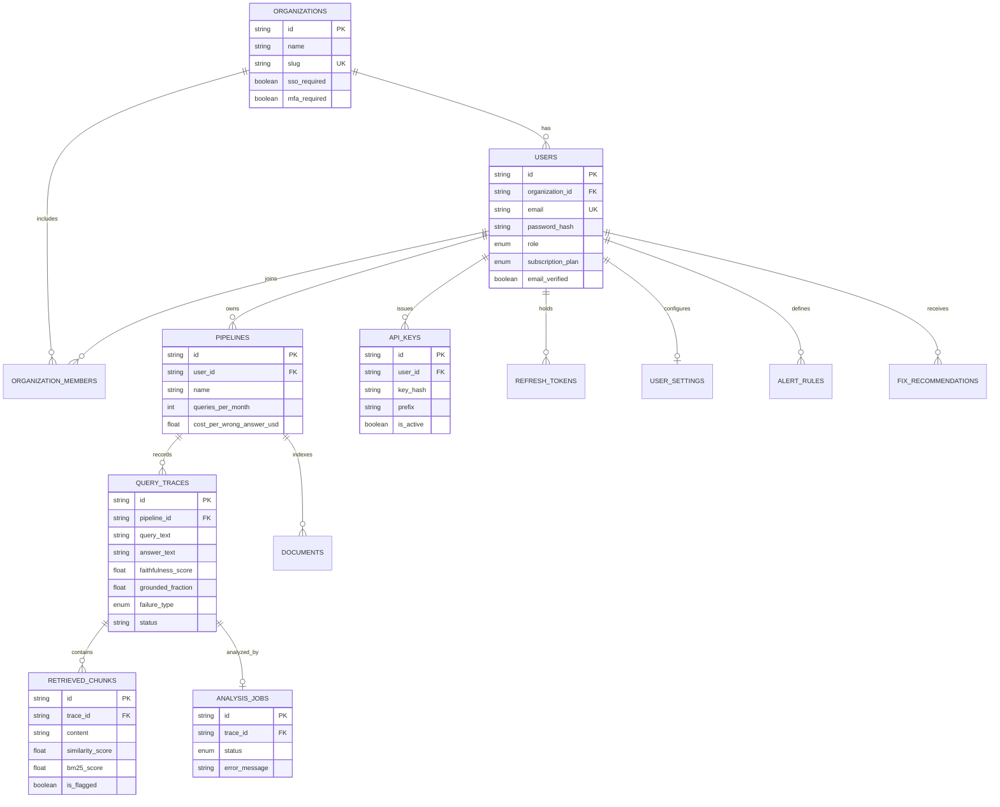

# Database entity-relationship overview

Core relational model for orgs, users, pipelines, traces, chunks, and analysis jobs. Primary keys are `VARCHAR(36)` UUIDs. Full column detail lives in `backend/app/models/models.py` and Alembic migrations.

Indexes for list filters (status, pipeline, created_at) are documented in [`INDEXES.md`](../INDEXES.md). Vector extension is optional on Postgres for embedding workloads.

See also: [DATABASE.md](../engineering/DATABASE.md).
