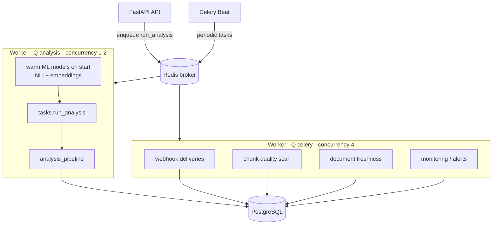

# Celery worker architecture

Analysis and scheduled maintenance run in Celery workers that share application service code with the API. Analysis workers keep ML model concurrency low; default-queue workers handle lighter beat and webhook tasks.

| Setting | Guidance |
|---------|----------|
| `worker_prefetch_multiplier` | `1` — avoid hoarding long ML jobs |
| `task_acks_late` | `true` — requeue on worker crash |
| `WARM_ML_MODELS_ON_WORKER_START` | `true` on analysis workers |
| Horizontal scale | Prefer more analysis replicas over concurrency > 2 |

Backlog visibility: `GET /api/v1/ops/backlog` and Prometheus `GET /api/v1/ops/metrics`.

See also: [WORKER.md](../WORKER.md), [COLD_START.md](../COLD_START.md), [13-queue-architecture.md](13-queue-architecture.md).
