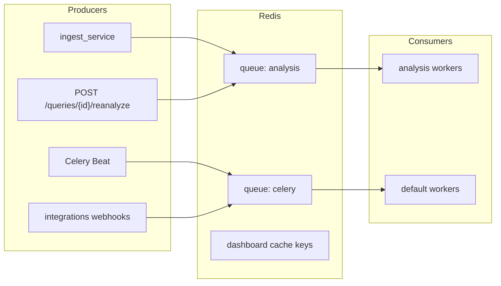
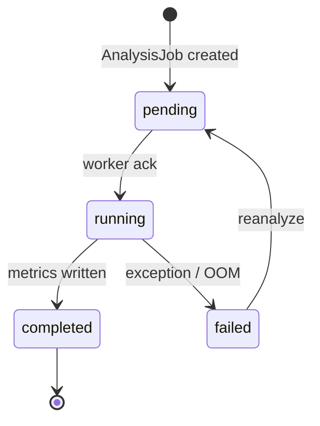

# Queue architecture

RAGInspector uses Redis lists as Celery brokers with two logical queues. Ingest never blocks on analysis completion: traces are stored first, then a task is enqueued (or marked failed if the broker is unavailable for later reanalyze).

| Queue | Typical tasks | Consumer profile |
|-------|---------------|------------------|
| `analysis` | `run_analysis` | Low concurrency, ML warmed |
| `celery` | webhooks, freshness, chunk scan, monitoring | Higher concurrency, no ML required |

Operational checks:

1. Workers must listen to every queue that receives messages (`analysis,celery` or dedicated pods).
2. Growing `analysis` depth with healthy workers → add analysis replicas.
3. After Redis outages, use reanalyze to drain failed traces.
4. Dashboard cache keys are independent of Celery queues; evict/TTL is handled in `dashboard_cache.py`.

See also: [01-ingest-sequence.md](01-ingest-sequence.md), [WORKER.md](../WORKER.md).
